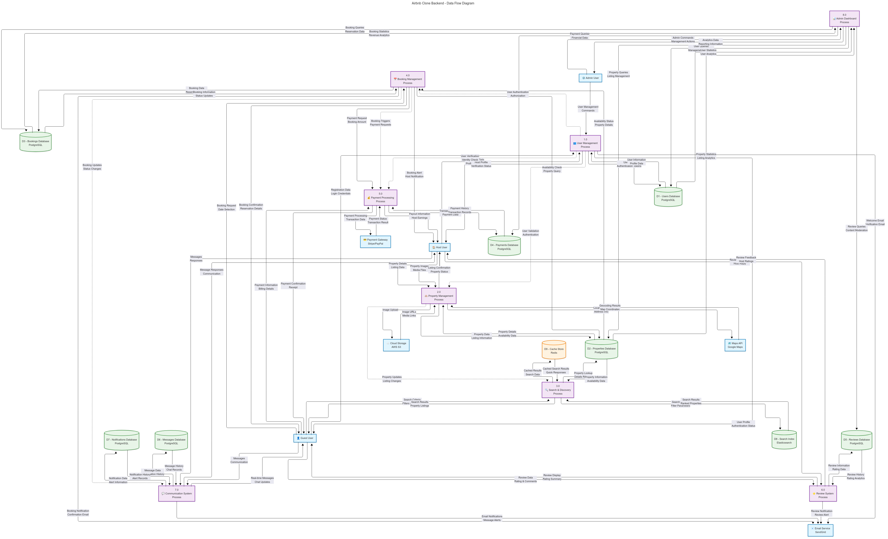

# Airbnb Clone Backend - Data Flow Diagram Documentation

## Overview

This document provides a comprehensive analysis of the Data Flow Diagram (DFD) for the Airbnb Clone backend system. The diagram illustrates how data moves through various system components, processes, and external entities to deliver the complete rental marketplace functionality.

---

## Table of Content

[Airbnb Clone Backend - Data Flow Diagram Documentation](#airbnb-clone-backend---data-flow-diagram-documentation)
[Overview](#overview)
[Diagram Components](#diagram-components)
    - [External Entities](#external-entities)
    - [Core Processes](#core-processes)
    - [Data Stores](#data-stores)
[Data Flow Diagram](#data-flow-diagram)
[Data Flow Analysis](#data-flow-analysis)
    [1. User Management Data Flow](#1-user-management-data-flow)
    [2. Property Management Data Flow](#2-property-management-data-flow)
    [3. Search & Discovery Data Flow](#3-search--discovery-data-flow)
    [4. Booking Management Data Flow](#4-booking-management-data-flow)
    [5. Payment Processing Data Flow](#5-payment-processing-data-flow)
    [6. Review System Data Flow](#6-review-system-data-flow)
    [7. Communication System Data Flow](#7-communication-system-data-flow)
    [8. Admin Dashboard Data Flow](#8-admin-dashboard-data-flow)
[Technical Implementation Guidelines](#technical-implementation-guidelines)
    [Database Design Principles](#database-design-principles)
    [API Design Standards](#api-design-standards)
    [Security Considerations](#security-considerations)
    [Performance Optimization](#performance-optimization)
    [Error Handling](#error-handling)
[Data Validation and Integrity](#data-validation-and-integrity)
    [Input Validation](#input-validation)
    [Data Integrity](#data-integrity)
[Monitoring and Analytics](#monitoring-and-analytics)
    [Data Flow Monitoring](#data-flow-monitoring)
    [Business Analytics](#business-analytics)
[Scalability Considerations](#scalability-considerations)
    [Horizontal Scaling](#horizontal-scaling)
    [Microservices Architecture](#microservices-architecture)
[Deployment and DevOps](#deployment-and-devops)
[Testing Strategy](#testing-strategy)
    [Unit Testing](#unit-testing)
    [Integration Testing](#integration-testing)
    [Performance Testing](#performance-testing)

---

## Diagram Components

### External Entities

* **Guest User** : End users searching for and booking properties
* **Host User** : Property owners listing and managing their rentals
* **Admin User** : System administrators managing the platform
* **Payment Gateway** : External payment processors (Stripe/PayPal)
* **Email Service** : External email service provider (SendGrid)
* **Maps API** : External mapping service (Google Maps)
* **Cloud Storage** : External file storage service (AWS S3)

### Core Processes

1. **User Management Process (1.0)** : Handles user registration, authentication, and profile management
2. **Property Management Process (2.0)** : Manages property listings, media, and availability
3. **Search & Discovery Process (3.0)** : Processes search queries and filters results
4. **Booking Management Process (4.0)** : Handles reservations and booking lifecycle
5. **Payment Processing Process (5.0)** : Manages financial transactions and payouts
6. **Review System Process (6.0)** : Handles ratings, reviews, and feedback
7. **Communication System Process (7.0)** : Manages messaging and notifications
8. **Admin Dashboard Process (8.0)** : Provides administrative oversight and analytics

### Data Stores

* **D1 - Users Database** : PostgreSQL table storing user information
* **D2 - Properties Database** : PostgreSQL table storing property listings
* **D3 - Bookings Database** : PostgreSQL table storing reservation data
* **D4 - Payments Database** : PostgreSQL table storing transaction records
* **D5 - Reviews Database** : PostgreSQL table storing reviews and ratings
* **D6 - Messages Database** : PostgreSQL table storing communication data
* **D7 - Notifications Database** : PostgreSQL table storing notification records
* **D8 - Search Index** : Elasticsearch index for optimized search
* **D9 - Cache Store** : Redis cache for performance optimization

## Data Flow Diagram

> 

## Data Flow Analysis

### 1. User Management Data Flow

**Input Data:**

* Registration information (email, password, profile details)
* Login credentials
* Profile updates and preferences

**Process Flow:**

1. Users submit registration/login data
2. System validates and processes authentication
3. User data stored in PostgreSQL database
4. Welcome/verification emails sent via external service
5. Authentication tokens generated and returned

**Output Data:**

* User profiles and authentication status
* JWT tokens for session management
* Email confirmations and notifications

**Django Implementation Considerations:**

```python
# models.py - Following Django best practices
class User(AbstractUser):
    user_type = models.CharField(max_length=10, choices=USER_TYPE_CHOICES)
    phone = models.CharField(max_length=15, blank=True)
    is_verified = models.BooleanField(default=False)
    created_at = models.DateTimeField(auto_now_add=True)
  
    class Meta:
        db_table = 'users'
        indexes = [
            models.Index(fields=['email']),
            models.Index(fields=['user_type']),
        ]
```

### 2. Property Management Data Flow

**Input Data:**

* Property details (title, description, location, pricing)
* Property images and media files
* Availability calendar updates

**Process Flow:**

1. Hosts submit property information
2. Images uploaded to cloud storage (AWS S3)
3. Location data geocoded via Maps API
4. Property data stored in database
5. Search index updated for discovery

**Output Data:**

* Property listings with media URLs
* Geocoded location coordinates
* Listing confirmations and status updates

**Django Implementation Considerations:**

```python
# models.py - Property model with proper relationships
class Property(models.Model):
    host = models.ForeignKey(User, on_delete=models.CASCADE, related_name='properties')
    title = models.CharField(max_length=200)
    description = models.TextField()
    price_per_night = models.DecimalField(max_digits=10, decimal_places=2)
    location = models.JSONField()  # Store geocoded data
    amenities = models.ManyToManyField('Amenity')
    is_active = models.BooleanField(default=True)
  
    class Meta:
        db_table = 'properties'
        indexes = [
            models.Index(fields=['location']),  # For geospatial queries
            models.Index(fields=['price_per_night']),
        ]
```

### 3. Search & Discovery Data Flow

**Input Data:**

* Search criteria (location, dates, guest count)
* Filter parameters (price range, amenities)
* Sorting preferences

**Process Flow:**

1. Guests submit search queries
2. Search engine processes criteria against Elasticsearch index
3. Results filtered and ranked
4. Property details retrieved from database
5. Results cached for performance

**Output Data:**

* Ranked property listings
* Search result metadata
* Cached responses for repeated queries

### 4. Booking Management Data Flow

**Input Data:**

* Booking requests with dates and guest details
* Cancellation requests
* Check-in/check-out confirmations

**Process Flow:**

1. Guests submit booking requests
2. System validates availability
3. Booking record created with status tracking
4. Notifications sent to host and guest
5. Calendar updated to prevent double booking

**Output Data:**

* Booking confirmations
* Reservation details and status
* Calendar updates

**Django Implementation Considerations:**

```python
# models.py - Booking model with status tracking
class Booking(models.Model):
    BOOKING_STATUS_CHOICES = [
        ('pending', 'Pending'),
        ('confirmed', 'Confirmed'),
        ('cancelled', 'Cancelled'),
        ('completed', 'Completed'),
    ]
  
    guest = models.ForeignKey(User, on_delete=models.CASCADE, related_name='bookings')
    property = models.ForeignKey(Property, on_delete=models.CASCADE)
    check_in = models.DateField()
    check_out = models.DateField()
    status = models.CharField(max_length=20, choices=BOOKING_STATUS_CHOICES)
    total_amount = models.DecimalField(max_digits=10, decimal_places=2)
  
    class Meta:
        db_table = 'bookings'
        constraints = [
            models.CheckConstraint(
                check=models.Q(check_out__gt=models.F('check_in')),
                name='check_out_after_check_in'
            )
        ]
```

### 5. Payment Processing Data Flow

**Input Data:**

* Payment information and billing details
* Booking amounts and fee calculations
* Payout requests from hosts

**Process Flow:**

1. Payment details submitted securely
2. External payment gateway processes transaction
3. Transaction records stored in database
4. Payment confirmations sent to users
5. Automated payouts scheduled for hosts

**Output Data:**

* Payment confirmations and receipts
* Transaction records and history
* Host payout information

### 6. Review System Data Flow

**Input Data:**

* Guest reviews and ratings
* Host responses to reviews
* Review moderation flags

**Process Flow:**

1. Reviews submitted after completed stays
2. Review data stored with validation
3. Average ratings calculated
4. Notifications sent to relevant parties
5. Reviews displayed on property listings

**Output Data:**

* Review displays and ratings
* Review analytics and summaries
* Moderation alerts

### 7. Communication System Data Flow

**Input Data:**

* Messages between guests and hosts
* System-generated notifications
* Communication preferences

**Process Flow:**

1. Messages submitted via in-app interface
2. Message data stored with encryption
3. Real-time notifications generated
4. Email alerts sent for important messages
5. Message history maintained

**Output Data:**

* Real-time message delivery
* Email notifications
* Communication history

### 8. Admin Dashboard Data Flow

**Input Data:**

* Administrative commands and queries
* Content moderation requests
* Analytics and reporting requests

**Process Flow:**

1. Admin users access dashboard interface
2. System queries relevant databases
3. Analytics data aggregated and processed
4. Reports generated with insights
5. Management actions executed

**Output Data:**

* Analytics dashboards and reports
* User and property management interfaces
* System health and performance metrics

## Technical Implementation Guidelines

### Database Design Principles

1. **Normalized Schema** : Follow 3NF principles while allowing strategic denormalization for performance
2. **Proper Indexing** : Create indexes on frequently queried fields
3. **Foreign Key Constraints** : Maintain referential integrity
4. **Data Types** : Use appropriate PostgreSQL data types (JSONB for flexible data)

### API Design Standards

```python
# views.py - RESTful API implementation
from rest_framework import viewsets, status
from rest_framework.decorators import action
from rest_framework.response import Response

class PropertyViewSet(viewsets.ModelViewSet):
    queryset = Property.objects.select_related('host').prefetch_related('amenities')
    serializer_class = PropertySerializer
  
    @action(detail=False, methods=['GET'])
    def search(self, request):
        """Advanced property search with filtering"""
        # Implementation following single responsibility principle
        pass
```

### Security Considerations

1. **Data Encryption** : Encrypt sensitive data at rest and in transit
2. **Input Validation** : Validate all input data using Django forms/serializers
3. **Authentication** : Implement JWT-based authentication with proper token management
4. **Authorization** : Use Django's permission system for role-based access control

### Performance Optimization

1. **Database Optimization** : Use select_related() and prefetch_related() for query optimization
2. **Caching Strategy** : Implement Redis caching for frequently accessed data
3. **Search Optimization** : Use Elasticsearch for complex search queries
4. **File Storage** : Use CDN for static assets and media files

### Error Handling

```python
# Exception handling following Django best practices
from rest_framework.views import exception_handler
from rest_framework.response import Response

def custom_exception_handler(exc, context):
    response = exception_handler(exc, context)
  
    if response is not None:
        custom_response_data = {
            'error': {
                'status_code': response.status_code,
                'message': response.data.get('detail', 'An error occurred'),
                'timestamp': timezone.now().isoformat()
            }
        }
        response.data = custom_response_data
  
    return response
```

## Data Validation and Integrity

### Input Validation

* Use Django serializers for API input validation
* Implement custom validators for business logic
* Sanitize all user inputs to prevent injection attacks

### Data Integrity

* Use database constraints to enforce business rules
* Implement model-level validation in Django models
* Use transactions for multi-step operations

## Monitoring and Analytics

### Data Flow Monitoring

* Track API response times and error rates
* Monitor database query performance
* Alert on unusual data flow patterns

### Business Analytics

* Track user engagement and conversion rates
* Monitor booking patterns and revenue metrics
* Analyze search behavior and property performance

## Scalability Considerations

### Horizontal Scaling

* Design stateless processes for easy scaling
* Use message queues for asynchronous processing
* Implement database read replicas for read-heavy operations

### Microservices Architecture

* Consider splitting processes into microservices as the system grows
* Implement proper service communication patterns
* Use API gateways for service orchestration

## Deployment and DevOps

### Environment Configuration

```python
# settings.py - Environment-specific configurations
import os
from pathlib import Path

# Database configuration with connection pooling
DATABASES = {
    'default': {
        'ENGINE': 'django.db.backends.postgresql',
        'NAME': os.getenv('DB_NAME'),
        'USER': os.getenv('DB_USER'),
        'PASSWORD': os.getenv('DB_PASSWORD'),
        'HOST': os.getenv('DB_HOST'),
        'PORT': os.getenv('DB_PORT'),
        'OPTIONS': {
            'MAX_CONNS': 20,
            'CONN_MAX_AGE': 600,
        }
    }
}

# Redis configuration for caching
CACHES = {
    'default': {
        'BACKEND': 'django_redis.cache.RedisCache',
        'LOCATION': os.getenv('REDIS_URL'),
        'OPTIONS': {
            'CLIENT_CLASS': 'django_redis.client.DefaultClient',
        }
    }
}
```

## Testing Strategy

### Unit Testing

* Test individual components and functions
* Mock external services and dependencies
* Achieve >90% code coverage

### Integration Testing

* Test data flow between components
* Validate API endpoints and responses
* Test database interactions

### Performance Testing

* Load test critical data flows
* Monitor response times under load
* Test caching effectiveness

---

*This Data Flow Diagram serves as the foundation for implementing a robust, scalable Airbnb Clone backend system following Django best practices and industry standards.*
