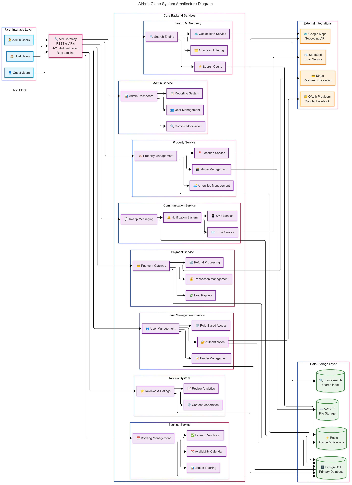

# Airbnb Clone Backend - Features and Functionalities Documentation

## Project Overview

This document outlines the comprehensive features and functionalities required for the Airbnb Clone backend system. The backend serves as the core engine powering a rental marketplace platform with robust user management, property listings, booking systems, and payment processing capabilities.

---

## Table of Content

[Airbnb Clone Backend - Features and Functionalities Documentation](#airbnb-clone-backend---features-and-functionalities-documentation)
[Project Overview](#project-overview)
[Core Features Breakdown](#core-features-breakdown)
    - [1. User Management System](#1-user-management-system)
    - [2. Property Listings Management](#2-property-listings-management)
    - [3. Search and Discovery System](#3-search-and-discovery-system)
    - [4. Booking Management System](#4-booking-management-system)
    - [5. Payment Processing System](#5-payment-processing-system)
    - [6. Reviews and Ratings System](#6-reviews-and-ratings-system)
    - [7. Communication System](#7-communication-system)
    - [8. Administrative Dashboard](#8-administrative-dashboard)
[Technical Architecture Requirements](#technical-architecture-requirements)
    - [Database Schema](#database-schema)
    - [API Architecture](#api-architecture)
    - [Security Framework](#security-framework)
    - [Performance Optimization](#performance-optimization)
    - [Integration Services](#integration-services)
[Non-Functional Requirements]
    - [Scalability](#scalability)
    - [Security](#security)
    - [Performance](#performance)
    - [Testing Strategy](#testing-strategy)

---

## Core Features Breakdown

### 1. User Management System

**Purpose:** Handle user lifecycle and authentication for guests, hosts, and administrators

#### 1.1 User Registration & Authentication

* **User Registration**
  * Multi-role registration (Guest, Host, Admin)
  * Email verification workflow
  * Secure password hashing (bcrypt/argon2)
  * Profile creation with mandatory fields
* **Authentication & Authorization**
  * JWT-based session management
  * OAuth2 integration (Google, Facebook, GitHub)
  * Role-based access control (RBAC)
  * Password reset functionality
  * Two-factor authentication (2FA) support

#### 1.2 Profile Management

* **User Profiles**
  * Personal information management
  * Profile photo upload and management
  * Contact information updates
  * Preference settings
  * Account verification status

### 2. Property Listings Management

**Purpose:** Enable hosts to create, manage, and showcase their rental properties

#### 2.1 Listing Operations

* **Property Creation**
  * Comprehensive property details (title, description, location)
  * Pricing configuration (base price, seasonal rates)
  * Amenities selection and management
  * House rules and policies
  * Availability calendar management
* **Listing Management**
  * Edit existing listings
  * Soft delete/archive listings
  * Listing status management (active, inactive, draft)
  * Bulk operations for multiple properties

#### 2.2 Media Management

* **Image Handling**
  * Multiple photo uploads per listing
  * Image optimization and resizing
  * Cover photo selection
  * Image ordering and management
  * Cloud storage integration (AWS S3/Cloudinary)

### 3. Search and Discovery System

**Purpose:** Help guests find suitable properties based on their criteria

#### 3.1 Search Functionality

* **Location-based Search**
  * Address/city/region search
  * Geolocation-based proximity search
  * Map integration with property markers
  * Boundary-based area filtering
* **Advanced Filtering**
  * Price range filtering
  * Guest capacity filtering
  * Date availability checking
  * Amenity-based filtering
  * Property type filtering
  * Instant booking availability

#### 3.2 Search Optimization

* **Performance Features**
  * Elasticsearch integration for fast search
  * Search result caching
  * Pagination with efficient loading
  * Search suggestion and autocomplete
  * Sorting options (price, rating, distance)

### 4. Booking Management System

**Purpose:** Handle the complete booking lifecycle from reservation to completion

#### 4.1 Reservation Process

* **Booking Creation**
  * Date availability validation
  * Real-time calendar updates
  * Double booking prevention
  * Pricing calculation with taxes and fees
  * Booking confirmation workflow
* **Booking Lifecycle**
  * Status tracking (pending, confirmed, cancelled, completed)
  * Check-in/check-out management
  * Booking modifications (date changes, cancellations)
  * Host approval workflow for requests

#### 4.2 Cancellation Management

* **Cancellation Policies**
  * Flexible, moderate, and strict policies
  * Automated refund calculations
  * Cancellation deadline enforcement
  * Host and guest cancellation handling

### 5. Payment Processing System

**Purpose:** Secure financial transactions between guests and hosts

#### 5.1 Payment Integration

* **Payment Gateways**
  * Stripe integration for card payments
  * PayPal integration
  * Multiple currency support
  * Secure payment tokenization
  * PCI compliance
* **Financial Operations**
  * Upfront payment collection
  * Automated host payouts
  * Security deposits handling
  * Tax calculation and collection
  * Refund processing

#### 5.2 Financial Reporting

* **Transaction Management**
  * Payment history tracking
  * Invoice generation
  * Financial reporting for hosts
  * Revenue analytics for admins

### 6. Reviews and Ratings System

**Purpose:** Build trust through transparent feedback between users

#### 6.1 Review Management

* **Review Creation**
  * Post-stay review prompts
  * Rating system (1-5 stars across categories)
  * Written review submission
  * Photo reviews support
  * Review authenticity verification
* **Review Display**
  * Average rating calculations
  * Review filtering and sorting
  * Host response to reviews
  * Review reporting and moderation

### 7. Communication System

**Purpose:** Enable secure communication between users

#### 7.1 Messaging Platform

* **In-app Messaging**
  * Real-time messaging between guests and hosts
  * Message threading and history
  * File and image sharing
  * Message encryption for privacy

#### 7.2 Notification System

* **Multi-channel Notifications**
  * Email notifications (booking confirmations, reminders)
  * In-app push notifications
  * SMS notifications for critical updates
  * Notification preferences management

### 8. Administrative Dashboard

**Purpose:** Provide comprehensive system management capabilities

#### 8.1 User Management

* **Admin Controls**
  * User account management
  * Account verification and suspension
  * Role assignment and permissions
  * User activity monitoring

#### 8.2 Content Moderation

* **Listing Oversight**
  * Property listing approval workflow
  * Content moderation tools
  * Quality assurance checks
  * Policy compliance monitoring

#### 8.3 Analytics and Reporting

* **Business Intelligence**
  * Platform usage analytics
  * Revenue tracking and reporting
  * User behavior analysis
  * Performance metrics dashboard

## Technical Architecture Requirements

### Database Schema

* **Primary Database:** PostgreSQL
* **Core Tables:**
  * `users` (authentication and profile data)
  * `properties` (listing information)
  * `bookings` (reservation data)
  * `reviews` (feedback and ratings)
  * `payments` (transaction records)
  * `messages` (communication logs)
  * `notifications` (system alerts)

### API Architecture

* **RESTful API Design**
  * Resource-based URL structure
  * Proper HTTP methods and status codes
  * JSON request/response format
  * API versioning strategy (/api/v1/)

### Security Framework

* **Authentication & Authorization**
  * JWT token management
  * Role-based access control
  * Rate limiting and throttling
  * Input validation and sanitization
  * HTTPS enforcement

### Performance Optimization

* **Caching Strategy**
  * Redis for session and data caching
  * Database query optimization
  * CDN for static assets
  * Lazy loading for large datasets

### Integration Services

* **Third-party Services**
  * Email service (SendGrid/Mailgun)
  * Cloud storage (AWS S3/Cloudinary)
  * Payment processing (Stripe/PayPal)
  * Maps and geocoding (Google Maps API)

## Non-Functional Requirements

### Scalability

* Horizontal scaling capability
* Load balancing support
* Database replication and sharding
* Microservices architecture consideration

### Security

* Data encryption at rest and in transit
* Regular security audits
* GDPR compliance for user data
* Secure coding practices

### Performance

* < 200ms API response times
* 99.9% uptime availability
* Efficient database indexing
* Optimized query performance

### Testing Strategy

* Unit testing coverage > 90%
* Integration testing for API endpoints
* End-to-end testing for critical workflows
* Performance and load testing

---

## Diagram

The backend feature system can be viewed in the diagram below:



---

Project Structure

```text
alx-airbnb-project-documentation/
└── features-and-functionalities/
    ├── README.md
    └── backend-features.png
```

---

*This documentation serves as the foundation for the Airbnb Clone backend development, ensuring all stakeholders understand the scope and complexity of the required features and functionalities.*
