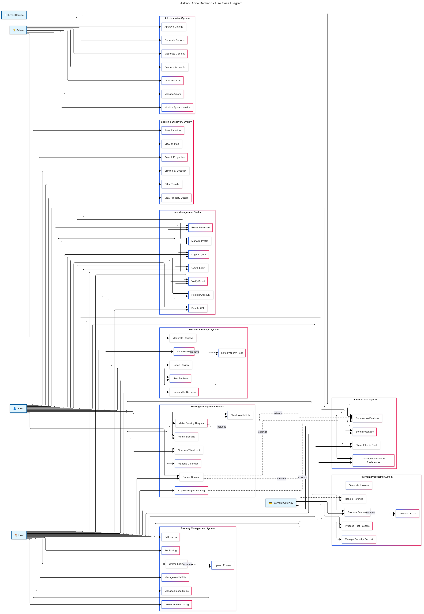

# Airbnb Clone Backend - Use Case Diagram Documentation

## Project Overview

This document presents the comprehensive use case diagram for the Airbnb Clone backend system, visualizing the interactions between different actors (users) and the system functionalities. The diagram follows UML standards and captures all key business processes outlined in the project requirements.

---

## Table of Contents

* [Airbnb Clone Backend - Use Case Diagram Documentation](#airbnb-clone-backend---use-case-diagram-documentation)
* [Actors Overview](#actors-overview)
* [Use Case Systems](#use-case-systems)
  * [Use Case Diagram](#use-case-diagram)
* [Actor-System Interactions](9#actor-system-interactions)
* [Key Relationships](9#key-relationships)
* [Business Rules](9#business-rules)
* [Implementation Notes](#implementation-notes)
* [Django Model Mapping](#django-model-mapping)

---

## Actors Overview

The system identifies five primary actors that interact with the Airbnb Clone backend:

### 1. Guest (Primary Actor)

* **Role** : End users who search for and book properties
* **Capabilities** : Registration, property search, booking management, payments, reviews
* **Access Level** : Standard user permissions

### 2. Host (Primary Actor)

* **Role** : Property owners who list and manage rental properties
* **Capabilities** : Property management, booking approval, calendar management, host payouts
* **Access Level** : Enhanced permissions for property management

### 3. Admin (Primary Actor)

* **Role** : System administrators who manage the platform
* **Capabilities** : User management, content moderation, analytics, system monitoring
* **Access Level** : Full administrative permissions

### 4. Payment Gateway (External Actor)

* **Role** : Third-party payment processing service (Stripe/PayPal)
* **Capabilities** : Process payments, handle refunds, manage transactions
* **Integration** : RESTful API integration

### 5. Email Service (External Actor)

* **Role** : External email service provider (SendGrid/Mailgun)
* **Capabilities** : Send notifications, verification emails, system alerts
* **Integration** : SMTP/API integration

---

## Use Case Systems

The use case diagram is organized into seven major functional systems:

### 1. User Management System

Handles user lifecycle and authentication processes:

* **UC1** : Register Account - Multi-role registration with email verification
* **UC2** : Login/Logout - JWT-based authentication with session management
* **UC3** : Manage Profile - Profile information and preferences management
* **UC4** : Verify Email - Email verification workflow for account activation
* **UC5** : Reset Password - Secure password reset functionality
* **UC6** : Enable 2FA - Two-factor authentication setup
* **UC7** : OAuth Login - Social media authentication (Google, Facebook, GitHub)

### 2. Property Management System

Enables hosts to create and manage property listings:

* **UC8** : Create Listing - Comprehensive property creation with details
* **UC9** : Edit Listing - Modify existing property information
* **UC10** : Upload Photos - Image management with cloud storage integration
* **UC11** : Manage Availability - Calendar management and availability updates
* **UC12** : Set Pricing - Dynamic pricing configuration with seasonal rates
* **UC13** : Delete/Archive Listing - Soft delete functionality for listings
* **UC14** : Manage House Rules - Property-specific rules and policies

### 3. Search & Discovery System

Facilitates property discovery for guests:

* **UC15** : Search Properties - Location-based and keyword search
* **UC16** : Filter Results - Advanced filtering by price, amenities, capacity
* **UC17** : View Property Details - Detailed property information display
* **UC18** : Save Favorites - Wishlist functionality for properties
* **UC19** : Browse by Location - Geographic browsing capabilities
* **UC20** : View on Map - Interactive map integration with property markers

### 4. Booking Management System

Manages the complete booking lifecycle:

* **UC21** : Make Booking Request - Guest-initiated booking process
* **UC22** : Approve/Reject Booking - Host booking approval workflow
* **UC23** : Modify Booking - Date changes and booking modifications
* **UC24** : Cancel Booking - Cancellation process with policy enforcement
* **UC25** : Check Availability - Real-time availability validation
* **UC26** : Manage Calendar - Host calendar management and blocking
* **UC27** : Check-in/Check-out - Booking completion process

### 5. Payment Processing System

Handles all financial transactions:

* **UC28** : Process Payment - Secure payment processing with multiple gateways
* **UC29** : Handle Refunds - Automated refund processing based on policies
* **UC30** : Manage Security Deposit - Security deposit handling and release
* **UC31** : Generate Invoices - Automated invoice generation for bookings
* **UC32** : Process Host Payouts - Scheduled host payment processing
* **UC33** : Calculate Taxes - Tax calculation and collection

### 6. Reviews & Ratings System

Manages feedback and trust-building:

* **UC34** : Write Review - Post-stay review submission
* **UC35** : Rate Property/Host - Multi-category rating system
* **UC36** : Respond to Reviews - Host response to guest reviews
* **UC37** : View Reviews - Review display and filtering
* **UC38** : Report Review - Review reporting for inappropriate content
* **UC39** : Moderate Reviews - Admin review moderation and approval

### 7. Communication System

Enables secure user communication:

* **UC40** : Send Messages - Real-time messaging between users
* **UC41** : Receive Notifications - Multi-channel notification delivery
* **UC42** : Manage Notification Preferences - User notification settings
* **UC43** : Share Files in Chat - File and image sharing in messages

### 8. Administrative System

Provides comprehensive system management:

* **UC44** : Manage Users - User account administration
* **UC45** : Moderate Content - Content approval and moderation
* **UC46** : View Analytics - Platform usage and performance analytics
* **UC47** : Generate Reports - Business intelligence and reporting
* **UC48** : Suspend Accounts - Account suspension and management
* **UC49** : Approve Listings - Listing approval workflow
* **UC50** : Monitor System Health - System monitoring and maintenance

#### Use Case Diagram

The diagram highlights the key functional flows and actor responsibilities.
> 

---

## Actor-System Interactions

### Guest Interactions (21 Use Cases)

Guests interact with core platform features including user management, search, booking, payment, and communication systems. They have read-only access to property information and can initiate booking requests.

### Host Interactions (20 Use Cases)

Hosts have enhanced capabilities including property management, booking approval, calendar management, and payout processing. They can respond to reviews and manage guest communications.

### Admin Interactions (8 Use Cases)

Admins focus on system administration, content moderation, user management, and analytics. They have full access to all system data and administrative functions.

### External System Interactions

* **Payment Gateway** : Integrates with 6 payment-related use cases
* **Email Service** : Supports 3 notification and verification use cases

---

## Key Relationships

The diagram includes several important UML relationships:

### Include Relationships

* **UC21 includes UC25** : Booking requests must check availability
* **UC28 includes UC33** : Payment processing includes tax calculations
* **UC24 includes UC29** : Cancellations include refund processing
* **UC34 includes UC35** : Writing reviews includes rating submission
* **UC8 includes UC10** : Creating listings includes photo uploads

### Extend Relationships

* **UC22 extends UC41** : Booking approvals trigger notifications
* **UC21 extends UC41** : Booking requests trigger notifications
* **UC24 extends UC41** : Cancellations trigger notifications

---

## Business Rules

### Authentication & Authorization

1. All users must register and verify their email before accessing full features
2. Role-based access control ensures proper permission management
3. JWT tokens expire after configured intervals for security

### Booking Business Rules

1. Guests cannot book unavailable dates
2. Hosts must approve booking requests within 24 hours
3. Cancellation policies determine refund amounts
4. Double bookings are prevented through database constraints

### Payment Processing Rules

1. Payments are processed upfront for confirmed bookings
2. Host payouts occur 24 hours after guest check-in
3. Security deposits are released 48 hours after check-out
4. Refunds follow the property's cancellation policy

### Review System Rules

1. Reviews can only be submitted after completed stays
2. Both guests and hosts can review each other
3. Reviews are publicly visible after submission
4. Inappropriate reviews can be reported and moderated

---

## Implementation Notes

### Django Best Practices Applied

#### 1. Model Design

```python
# Example model structure following Django conventions
class Booking(models.Model):
    """
    Booking model representing a property reservation.
    Follows single responsibility principle.
    """
    guest = models.ForeignKey('users.User', on_delete=models.CASCADE, related_name='bookings')
    property = models.ForeignKey('properties.Property', on_delete=models.CASCADE)
    check_in = models.DateField()
    check_out = models.DateField()
    status = models.CharField(max_length=20, choices=BOOKING_STATUS_CHOICES)
    total_amount = models.DecimalField(max_digits=10, decimal_places=2)
    created_at = models.DateTimeField(auto_now_add=True)
    updated_at = models.DateTimeField(auto_now=True)
  
    class Meta:
        db_table = 'bookings'
        indexes = [
            models.Index(fields=['guest', 'status']),
            models.Index(fields=['property', 'check_in', 'check_out']),
        ]
```

#### 2. API Versioning

* All endpoints use `/api/v1/` prefix for version control
* Backward compatibility maintained through versioned serializers

#### 3. Input Validation

* Django REST Framework serializers for comprehensive validation
* Custom validators for business logic enforcement
* Rate limiting implemented using Django-ratelimit

#### 4. Error Handling

* Structured error responses with appropriate HTTP status codes
* Custom exception handlers for consistent error formatting
* Logging integration for error tracking

### Security Considerations

1. **Authentication** : JWT tokens with refresh token rotation
2. **Authorization** : Django permissions and custom role-based access
3. **Input Validation** : Comprehensive validation at serializer level
4. **Rate Limiting** : API endpoint protection against abuse
5. **Data Encryption** : Sensitive data encrypted at rest and in transit

### Performance Optimization

1. **Database Indexing** : Strategic indexes on frequently queried fields
2. **Caching** : Redis integration for session and query caching
3. **Pagination** : Efficient pagination for large datasets
4. **Query Optimization** : Select_related and prefetch_related usage

---

## Django Model Mapping

### Core Models Based on Use Cases

1. **User Model** (Custom User extending AbstractUser)
   * Supports UC1-UC7 (User Management)
   * Includes role field for RBAC
2. **Property Model**
   * Supports UC8-UC14 (Property Management)
   * Includes pricing, availability, and media relationships
3. **Booking Model**
   * Supports UC21-UC27 (Booking Management)
   * Includes status tracking and business rule enforcement
4. **Payment Model**
   * Supports UC28-UC33 (Payment Processing)
   * Integrates with external payment gateways
5. **Review Model**
   * Supports UC34-UC39 (Reviews & Ratings)
   * Includes moderation fields and rating categories
6. **Message Model**
   * Supports UC40-UC43 (Communication)
   * Real-time messaging with WebSocket support

### Suggested Django Apps Structure

```text
apps/
├── users/          # User management (UC1-UC7)
├── properties/     # Property management (UC8-UC14, UC15-UC20)
├── bookings/       # Booking management (UC21-UC27)
├── payments/       # Payment processing (UC28-UC33)
├── reviews/        # Reviews and ratings (UC34-UC39)
├── communications/ # Messaging system (UC40-UC43)
└── administration/ # Admin functions (UC44-UC50)
```

---

## Project Structure

```text
alx-airbnb-project-documentation/
└── use-case-diagram/
    ├── README.md
    └── use-case-diagram.png
```

---

*This use case diagram serves as the foundation for understanding system interactions and will guide the development of the Airbnb Clone backend API endpoints and business logic implementation.*
